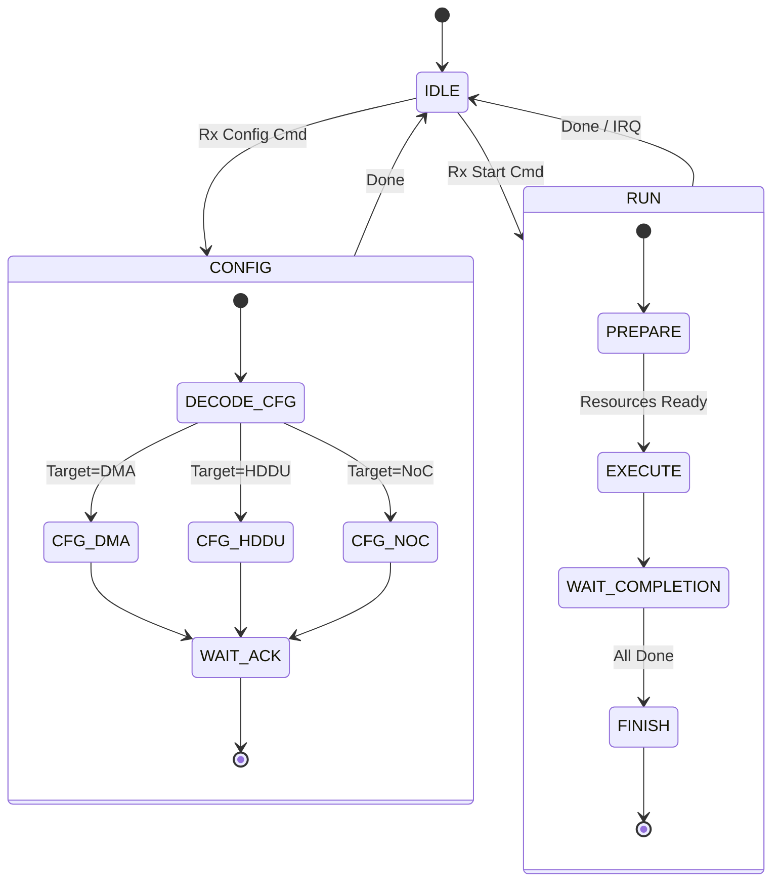

# CoreController Specification

## Overview
The `CoreController` is the central management unit of the HybridAcc. It acts as the "CPU" of the accelerator, fetching high-level commands from the host, decoding them, and configuring the sub-modules (DMA, HDDU, NoC) accordingly. It also handles interrupt generation and status reporting.

## Module Interface (IO Specification)

| Port Name | Type | Direction | Width | Description |
|-----------|------|-----------|-------|-------------|
| `clk` | `sc_in<bool>` | Input | 1 | System Clock |
| `reset_n` | `sc_in<bool>` | Input | 1 | Active Low Reset |
| `cmd_in` | `sc_in<sc_uint<32>>` | Input | 32 | Command Input from Host |
| `cmd_valid` | `sc_in<bool>` | Input | 1 | Command Valid |
| `status_out` | `sc_out<sc_uint<32>>` | Output | 32 | Status Register Output |
| `irq` | `sc_out<bool>` | Output | 1 | Interrupt Request |
| `ctrl_dma` | `sc_out<dma_ctrl_t>` | Output | - | Control signals to DMA |
| `ctrl_hddu` | `sc_out<hddu_ctrl_t>` | Output | - | Control signals to HDDU |
| `ctrl_noc` | `sc_out<noc_ctrl_t>` | Output | - | Control signals to NoC |

## Internal Architecture

The CoreController implements a hierarchical state machine.

### State Machine Diagram

## Functionality

1.  **Command Parsing**:
    - Decodes 32-bit commands (Opcode + Payload).
    - Supported Opcodes: `CONFIG_REG`, `LOAD_UCODE`, `START_KERNEL`, `RESET`.

2.  **Global Synchronization**:
    - Ensures that configuration is complete before execution starts.
    - Monitors `busy` signals from all sub-modules.

3.  **Interrupt Management**:
    - Asserts `irq` when a kernel completes or if an error occurs.
    - Clears `irq` upon host acknowledgement.

4.  **Debug Interface**:
    - Provides access to internal performance counters (cycles, stall counts) via the `status_out` port.
