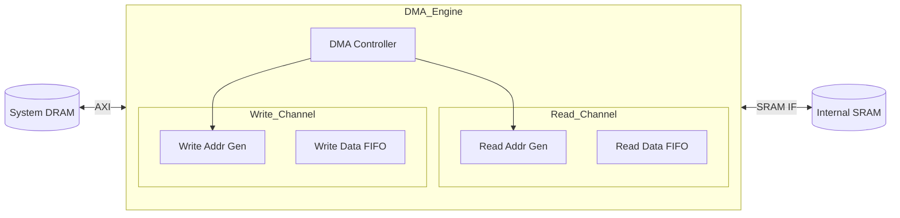

# DMA (Direct Memory Access) Specification

## Overview
The `DMA` module handles high-bandwidth data transfers between the external System Memory (DRAM) and the internal Global SRAM (managed by HDDU). It offloads data movement tasks from the CoreController, allowing for overlapped computation and communication.

## Module Interface (IO Specification)

| Port Name | Type | Direction | Width | Description |
|-----------|------|-----------|-------|-------------|
| `clk` | `sc_in<bool>` | Input | 1 | System Clock |
| `reset_n` | `sc_in<bool>` | Input | 1 | Active Low Reset |
| `axi_m_rd` | `AXI_Master_Read` | Port | - | AXI Master Read Interface (to DRAM) |
| `axi_m_wr` | `AXI_Master_Write` | Port | - | AXI Master Write Interface (to DRAM) |
| `sram_wr` | `SRAM_Write_IF` | Port | - | Interface to write to Internal SRAM |
| `sram_rd` | `SRAM_Read_IF` | Port | - | Interface to read from Internal SRAM |
| `cfg_base_addr` | `sc_in<uint64_t>` | Input | 64 | Base Address in DRAM |
| `cfg_length` | `sc_in<uint32_t>` | Input | 32 | Transfer Length (bytes) |
| `start` | `sc_in<bool>` | Input | 1 | Start Transfer Trigger |
| `done` | `sc_out<bool>` | Output | 1 | Transfer Complete Signal |

## Internal Architecture

The DMA consists of two independent channels: Read Channel (DRAM -> SRAM) and Write Channel (SRAM -> DRAM).

### Architecture Diagram

## Functionality

1.  **Burst Mode Transfers**:
    - Utilizes AXI burst transactions (e.g., ARLEN/AWLEN) to maximize bus utilization.
    - Supports aligned and unaligned transfers.

2.  **2D Strided Access** (Optional/Advanced):
    - Can be configured to read rectangular regions from DRAM (useful for image processing).
    - Parameters: `stride_x`, `stride_y`, `block_width`, `block_height`.

3.  **Interrupts**:
    - Generates a `done` pulse upon completion of the programmed transfer.

4.  **Flow Control**:
    - Respects backpressure from both the AXI bus (ready/valid) and the internal SRAM interface.
