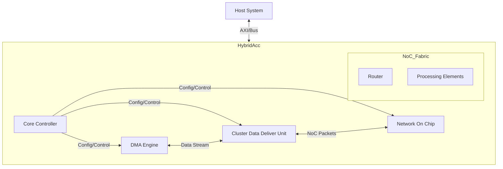

# HybridAcc Top-Level Module Specification

## Overview
`HybridAcc` is the top-level SystemC module representing the entire accelerator subsystem. It acts as the interface between the host system (CPU/System Bus) and the internal accelerator components. It orchestrates data movement, configuration, and execution control.

## Module Interface (IO Specification)

| Port Name | Type | Direction | Width | Description |
|-----------|------|-----------|-------|-------------|
| `clk` | `sc_in<bool>` | Input | 1 | System Clock |
| `reset_n` | `sc_in<bool>` | Input | 1 | Active Low Reset |
| `host_req` | `sc_in<host_req_t>` | Input | - | Request from Host (AXI-like or simple valid/ready) |
| `host_resp` | `sc_out<host_resp_t>` | Output | - | Response to Host |
| `irq` | `sc_out<bool>` | Output | 1 | Interrupt Request to Host |

## Internal Architecture

The HybridAcc module integrates the following major components:

1.  **CoreController**: The main state machine that parses host instructions (e.g., "Start Kernel", "Config") and coordinates the other units.
2.  **DMA (Direct Memory Access)**: Handles high-speed data transfer between System Memory (DRAM) and the internal HDDU/NoC.
3.  **ClusterDataDeliverUnit (HDDU)**: A specialized buffering and scheduling unit that feeds data into the NoC. It manages the "Shared Injection Port" arbitration and "Bus Locking".
4.  **NetworkOnChip (NoC)**: The interconnect fabric that houses the Processing Elements (PEs) and manages data distribution to them.

### System Block Diagram

## Operational Flow

1.  **Initialization**:
    - Host asserts `reset_n`.
    - `CoreController` initializes all sub-modules.

2.  **Configuration Phase**:
    - Host sends configuration packets via `host_req`.
    - `CoreController` routes these to `HDDU` (for tiling/stride config) or `NoC` (for PE microcode loading).

3.  **Execution Phase**:
    - Host triggers "Start".
    - `DMA` fetches data from system memory.
    - `HDDU` buffers data, applies "Smart Arbitration" (Priority/Locking), and injects it into the `NoC`.
    - `NoC` routes data to PEs.
    - PEs perform computation.

4.  **Writeback Phase**:
    - PEs send results back to `NoC`.
    - `NoC` routes results to `HDDU` (or separate Output Unit).
    - `DMA` writes results back to system memory.
    - `CoreController` asserts `irq` upon completion.
