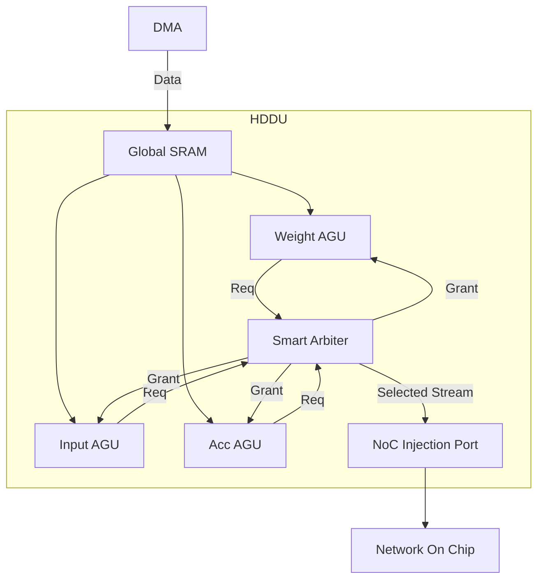

# HybridDataDeliverUnit (HDDU) Specification

## Overview
The `HybridDataDeliverUnit` (HDDU) is responsible for feeding data from the global buffer (or DMA) into the NoC. It implements the "Shared Injection Port" architecture, where multiple data streams (Weights, Inputs, Accumulators) compete for access to the NoC injection channel. It uses a "Smart Arbiter" to manage this contention efficiently.

## Module Interface (IO Specification)

| Port Name | Type | Direction | Width | Description |
|-----------|------|-----------|-------|-------------|
| `clk` | `sc_in<bool>` | Input | 1 | System Clock |
| `reset_n` | `sc_in<bool>` | Input | 1 | Active Low Reset |
| `dma_in_data` | `sc_in<sc_biguint<256>>` | Input | 256 | Data from DMA |
| `dma_in_valid` | `sc_in<bool>` | Input | 1 | DMA Data Valid |
| `dma_in_ready` | `sc_out<bool>` | Output | 1 | HDDU Ready for DMA |
| `noc_out_data` | `sc_out<sc_biguint<256>>` | Output | 256 | Data to NoC |
| `noc_out_valid` | `sc_out<bool>` | Output | 1 | NoC Injection Valid |
| `noc_out_ready` | `sc_in<bool>` | Input | 1 | NoC Backpressure |
| `cfg_arb_ctrl` | `sc_in<sc_uint<32>>` | Input | 32 | Arbitration Control Register |

## Internal Architecture

The HDDU consists of three main Address Generation Units (AGUs) and a central Arbiter.

1.  **Weight AGU**: Manages weight data streams. High priority during kernel loading.
2.  **Input AGU**: Manages input feature map streams.
3.  **Acc AGU**: Manages partial sum/accumulator streams.
4.  **Smart Arbiter**: Multiplexes the three AGUs into the single NoC port.

### Architecture Diagram

## Address Generation Unit (4D AGU) Specification

Each AGU (Weight, Input, Acc) inside the HDDU is a programmable 4-Dimensional Address Generator based on the **HDDU v2 Specification**. It supports complex tensor traversal, NoC tag generation, and bus locking.

### Functionality and Timeline

The AGU operates as a nested loop controller with 4 levels (L0 to L3).
- **L0 (Inner-most)**: Usually corresponds to the continuous data dimension.
- **L3 (Outer-most)**: Usually corresponds to batch or output channel tiling.

#### Timeline Behavior
1.  **Idle State**: AGU waits for the `START` signal in `CFG_CTRL`.
2.  **Running State**:
    - In every cycle, the AGU calculates `Addr = Base + Offset`.
    - It increments the L0 counter.
    - If L0 counter wraps, it increments L1, and so on.
    - **Tag Generation**: Updates the NoC Tag ID based on `CFG_TAG_LOOP` and `CFG_TAG_STRIDE`.
    - **Locking**: Asserts lock signal to Arbiter if `LOCK_EN` is set, releasing it only when the loop level specified by `LOCK_LEVEL` completes.
3.  **Stall State**: If the Arbiter does not grant access, the AGU freezes.
4.  **Done State**: When L3 counter wraps (and not in Repeat Mode), the AGU clears the Start bit and returns to Idle.

### MMIO Specification (HDDU v2)

Registers are 32-bit wide. Offsets are shown in bytes.

| Offset | Register Name | Description |
|--------|---------------|-------------|
| `0x00` | `CFG_BASE_ADDR_L` | Base Address Low (32-bit) |
| `0x04` | `CFG_BASE_ADDR_H` | Base Address High (32-bit) |
| `0x08` | `CFG_ITER_0_1` | Loop Counts. `[15:0]` Iter 0, `[31:16]` Iter 1 |
| `0x0C` | `CFG_ITER_2_3` | Loop Counts. `[15:0]` Iter 2, `[31:16]` Iter 3 |
| `0x10` | `CFG_STRIDE_0` | Stride for Level 0 (32-bit Signed) |
| `0x14` | `CFG_STRIDE_1` | Stride for Level 1 (32-bit Signed) |
| `0x18` | `CFG_STRIDE_2` | Stride for Level 2 (32-bit Signed) |
| `0x1C` | `CFG_STRIDE_3` | Stride for Level 3 (32-bit Signed) |
| `0x20` | `CFG_CTRL` | Control Register.   `[0]` Start   `[1]` Reset   `[2]` Repeat Mode   `[8]` Lock Enable   `[10:9]` Lock Level |
| `0x40` | `CFG_TAG_BASE` | **NoC Tag Base**   `[5:0]` Base Tag ID   `[9:6]` Channel ID   `[10]` Multicast Enable |
| `0x44` | `CFG_TAG_STRIDE` | **NoC Tag Stride**   Increment value for Tag ID. |
| `0x48` | `CFG_TAG_WIDTH` | **NoC Tag Width/Mask**   Range/Mask for Tag wrapping. |
| `0x4C` | `CFG_TAG_LOOP` | **Tag Update Loop Level**   `[1:0]` Loop Level (0-3) which triggers Tag update. |

## Smart Arbitration Logic

The Arbiter operates based on the `CFG_ARB_CTRL` register settings.

### Priority Logic
- **Fixed Priority**: Weight > Input > Acc (Default).
- **Round Robin**: Rotates grant among active requestors.

### Bus Locking Mechanism
To prevent interleaving of atomic data packets (e.g., a full weight kernel), the Arbiter supports "Locking".
- **Lock Enable**: When an AGU asserts a lock request, the Arbiter grants exclusive access to that AGU until the lock is released.
- **Lock Level**: Defines which streams can interrupt a lock (usually none).

### Flow Control
- If `noc_out_ready` is low (NoC congested), the Arbiter pauses all AGUs.
- AGUs contain internal FIFOs to absorb small latency variations.

## Configuration Registers
- `CFG_TAG_W`: Base tag for Weight packets.
- `CFG_TAG_I`: Base tag for Input packets.
- `CFG_TAG_A`: Base tag for Acc packets.
- `CFG_ARB_CTRL`: [31] Lock Enable, [1:0] Priority Mode.
