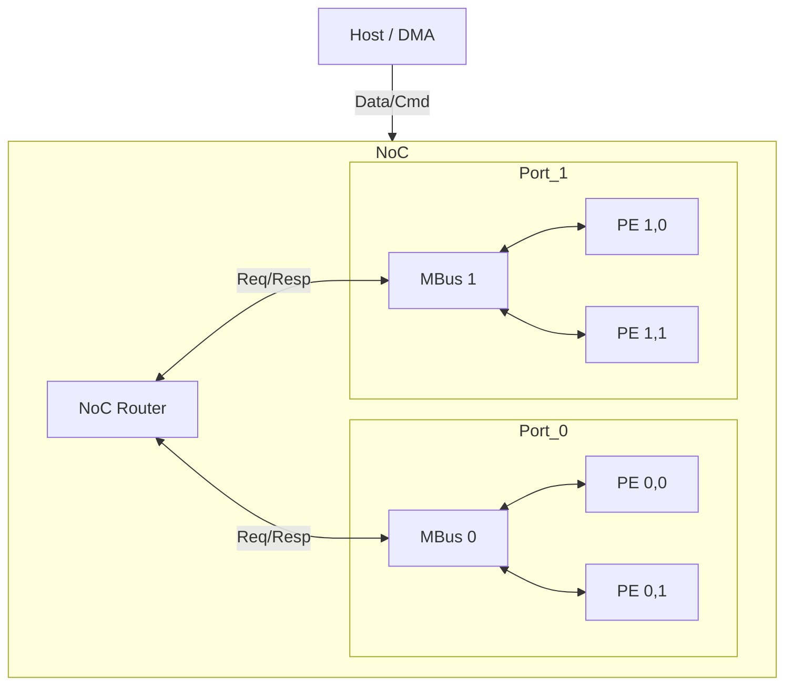

# NetworkOnChip (NoC) Module Specification

## Overview
The `NetworkOnChip` module is the top-level interconnect and processing container in the HybridAcc ESL simulator. It integrates the NoC Router, Memory Buses (MBus), and Processing Elements (PEs). It manages data distribution from the host/DMA to the PEs and handles inter-PE communication.

## Module Interface (IO Specification)

| Port Name | Type | Direction | Width | Description |
|-----------|------|-----------|-------|-------------|
| `clk` | `sc_in<bool>` | Input | 1 | System Clock |
| `reset_n` | `sc_in<bool>` | Input | 1 | Active Low Reset |
| `command_mode` | `sc_in<bool>` | Input | 1 | Command Mode Flag (0: Data, 1: Command) |
| `command_data` | `sc_in<sc_uint<32>>` | Input | 32 | Command Payload (for configuration) |
| `en` | `sc_in<bool>` | Input | 1 | Chip Enable |
| `wen` | `sc_in<bool>` | Input | 1 | Write Enable (Global) |
| `addr` | `sc_in<sc_uint<10>>` | Input | 10 | Address Input ([9] cmd, [8] SIMD, [7:6] channel, [5:0] tag) |
| `data_in` | `sc_in<sc_biguint<256>>` | Input | 256 | Data Input Bus |
| `data_out` | `sc_out<sc_biguint<256>>` | Output | 256 | Data Output Bus |

## Parameters
- `num_port`: Number of NoC ports (e.g., 4).
- `num_pes_per_port`: Number of PEs connected to each MBus port (e.g., 4).
- Total PEs = `num_port` * `num_pes_per_port`.

## Internal Architecture

The NoC module contains the following sub-modules:
1.  **NoCRouter**: The central router handling packet switching between ports.
2.  **MBUS (Memory Bus)**: One per port. Distributes data from the Router to the PEs attached to that port.
3.  **ProcessElement (PE)**: The compute units.

### Architecture Diagram

## Signal Descriptions

### NoC to MBus Interface
- `noc_to_bus_req`: Vector of request signals from Router to MBus.
- `bus_to_noc_resp`: Vector of response signals from MBus to Router.

### MBus to PE Interface
- `bus_to_pe_req`: Vector of vectors. Requests from MBus to specific PEs.
- `pe_to_bus_resp`: Vector of vectors. Responses from PEs to MBus.
- `pe_busy`: Status signal indicating if a PE is busy.

### PE to PE Interface (Local Network)
- `ln_pli_plo`: Local Network (Neighbor) connections for systolic array or ring configurations.

## Functionality

1.  **Configuration**:
    - Accepts commands via `command_mode` and `command_data` to configure the Router and PEs.
    - Supports `NOCDMA` style bulk configuration.

2.  **Data Distribution**:
    - Routes data packets based on `addr` (Channel, Tag).
    - Supports Multicast (SIMD) to multiple PEs via MBus.

3.  **Execution**:
    - Manages the `scan_chain` for debugging and state inspection.
    - Aggregates `pe_busy` signals to determine system idle state.
