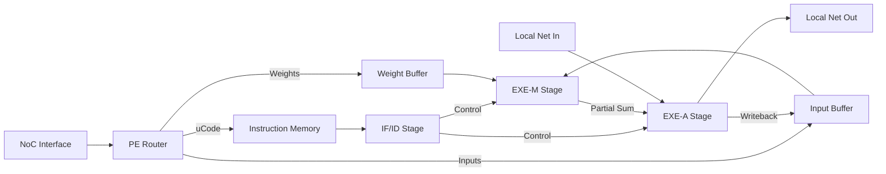

# ProcessElement (PE) Module Specification

## Overview
The `ProcessElement` (PE) is the core computational unit of the HybridAcc architecture. It implements a 3-stage pipeline (IF/ID, EXE-M, EXE-A) to execute custom instructions for convolution, matrix multiplication, and other tensor operations. It connects to the NoC via a Router and to neighbors via a Local Network.

## Module Interface (IO Specification)

| Port Name | Type | Direction | Description |
|-----------|------|-----------|-------------|
| `clk` | `sc_in<bool>` | Input | System Clock |
| `reset_n` | `sc_in<bool>` | Input | Active Low Reset |
| `router_enable` | `sc_in<bool>` | Input | Enable signal for the internal PE Router |
| `router_mode` | `sc_in<PERouterMode>` | Input | Mode selection for PE Router (e.g., UNICAST, BROADCAST) |
| `noc_req` | `VRDIF<noc_request_t>` | Input | NoC Request Interface (Valid/Ready/Data) |
| `noc_resp` | `VRDOF<noc_response_t>` | Output | NoC Response Interface (Valid/Ready/Data) |
| `pe_busy` | `sc_out<bool>` | Output | Busy status signal |
| `ln_pli` | `VRDIF<uint64_t>` | Input | Local Network Input (from Left/Neighbor) |
| `ln_plo` | `VRDOF<uint64_t>` | Output | Local Network Output (to Right/Neighbor) |

## Internal Architecture

The PE consists of the following main components:

1.  **PE Router**: Handles incoming data from the NoC and directs it to the appropriate internal buffer (Weight Buffer, Input Buffer) or control register.
2.  **IF_ID_Stage (Instruction Fetch / Instruction Decode)**:
    - Fetches instructions from the microcode memory.
    - Decodes instructions into control signals.
    - Handles loop control and branching.
3.  **EXE_M_Stage (Execute - Multiplier)**:
    - Performs multiplication operations (e.g., MAC).
    - Accesses the Weight Buffer and Input Buffer (Scratchpad).
4.  **EXE_A_Stage (Execute - Adder/Accumulator)**:
    - Performs accumulation and post-processing (ReLU, Quantization).
    - Manages the Accumulator Registers.
    - Handles data movement to/from the Local Network (`ln_pli`, `ln_plo`).

### Pipeline Diagram

## Pipeline Stages Detail

### IF_ID Stage
- **Function**: Fetches 32-bit instructions from the local Instruction Memory (IM).
- **Logic**:
    - Maintains `pc` (Program Counter).
    - Decodes opcodes (CONV, GEMM, ALU, etc.).
    - Generates stall signals if dependencies are not met.

### EXE_M Stage
- **Function**: The "Multiplier" stage.
- **Logic**:
    - Reads operands from SRAM (Input/Weight).
    - Performs 16-bit/8-bit multiplications.
    - Pipelined to feed the Adder stage.

### EXE_A Stage
- **Function**: The "Adder" stage.
- **Logic**:
    - Accumulates results from EXE_M.
    - Adds values from Local Network (systolic flow).
    - Writes results back to Input Buffer or sends to Local Network.

## Control Logic
- **Stall Propagation**: The PE implements a back-pressure mechanism. If EXE_A stalls (e.g., waiting for output readiness), it stalls EXE_M, which in turn stalls IF_ID.
- **Busy Signal**: `pe_busy` is asserted when the pipeline is active or when there are pending operations.
