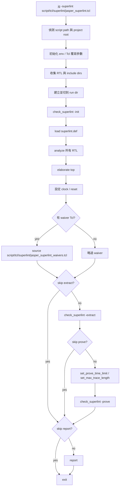

# HybridAcc Superlint Tcl Guide

Repo-wide 操作入口請先看 [../../../doc/index.md](../../../doc/index.md) 與 [../../../doc/user-manual/lint-and-formal.md](../../../doc/user-manual/lint-and-formal.md)；本文件保留 Jasper/Superlint 的 subsystem 細節。

## 範圍

這份文件整理 `design/hybridacc-RTL/script/tcl/superlint` 目錄下所有 Superlint Tcl 的用途與實際執行流程；主流程、waiver、query、probe 與局部抽取腳本都已統一放在這個目錄。

本文重點不是 JasperGold 本身的通用語法，而是這個專案內各個 Tcl 檔如何分工、彼此如何調用，以及它們在實際 debug / report 流程中的位置。

## 目錄與角色總覽

### 主流程檔

| 檔案 | 角色 | 是否為主入口 |
| --- | --- | --- |
| `script/tcl/superlint/jasper_superlint.tcl` | 建立完整 HybridAcc Superlint run：找 project root、收集 RTL、analyze、elaborate、載入 rule、套用 waiver、extract、prove、report | 是 |
| `script/tcl/superlint/jasper_superlint_waivers.tcl` | 在 elaborate 後、extract 前，對專案既知且接受的 warning/error 類型做 instance/module 級排除 | 否，由 canonical 主流程 source |

### 輔助腳本總類

| 類別 | 代表檔案 | 主要用途 |
| --- | --- | --- |
| 全設計統計查詢 | `jasper_warning_query.tcl`, `jasper_report_query.tcl` | 列出 warning/error 總數、tag 分布與代表案例 |
| 熱點分析 | `jasper_warning_hotspot_query.tcl`, `jasper_error_hotspot_query.tcl`, `jasper_ctcl_hotspot_query.tcl`, `jasper_lat_notrtm_query.tcl`, `jasper_dead_logic_query.tcl` | 聚焦特定 tag，找出最密集的 source location 或詳細項目 |
| 模組/實例局部抽取 | `jasper_module_extract_query.tcl`, `jasper_perouter_extract_query.tcl`, `jasper_hddu_extract_query.tcl`, `jasper_hddu_error_query.tcl`, `jasper_exe_m_extract_query.tcl` | 跳過全設計 extract，改對單一 module instance 做 extract 並查明細 |
| 比較/驗證 probe | `jasper_perouter_exclude_probe.tcl`, `jasper_property_probe.tcl`, `jasper_warning_detail_probe.tcl` | 驗證 waiver 效果、反查 property 所屬、探測 `check_superlint -get` 可讀欄位 |
| 命令 help probe | `jasper_help_probe.tcl`, `jasper_help_elaborate.tcl`, `jasper_rtlds_help_probe.tcl` | 直接把 Jasper help 輸出印出來，確認支援命令和參數 |

## 核心結論

這一組腳本的真正主入口只有一個：`script/tcl/superlint/jasper_superlint.tcl`。

`script/tcl/superlint` 下面的大多數檔案都不是被主流程自動呼叫。它們是各自獨立的 Jasper Tcl entry point，執行模式通常是：

1. 自己偵測 RTL root。
2. 設定一些全域變數或環境覆寫，例如 run dir、skip prove、skip report。
3. `source script/tcl/superlint/jasper_superlint.tcl`，借用 canonical 主腳本完成 compile / elaborate / rule load / waiver load。
4. 再做自己的 `check_superlint -list`、`check_superlint -extract -instances`、`get_design_info` 或 `help`。
5. 印出固定格式結果後 `exit`。

也就是說，這些 helper script 和主腳本的關係是「重用主流程」，不是「由主流程調用」。

目前 Makefile 已提供這幾個實際入口：`make superlint_report`、`make superlint_hotspot`、`make superlint`。它們會在 tcsh 環境下啟動 Jasper，並呼叫 `script/tcl/superlint` 裡的 query script。

## 主入口：script/tcl/superlint/jasper_superlint.tcl

### 主要責任

`jasper_superlint.tcl` 負責把 HybridAcc RTL 帶進 Jasper Superlint 的完整分析流程。它同時處理環境自動偵測、參數初始化、檔案收集、規則開關、waiver 載入，以及最後的 extract / prove / report。

### 執行前可覆寫的主要變數

主腳本支援大量環境變數或 Tcl 全域變數覆寫，核心用途如下：

| 變數 | 用途 |
| --- | --- |
| `HACC_JG_PROJECT_ROOT` | 指定 RTL root，避免依賴自動偵測 |
| `RUN_TAG` | run label，影響預設輸出目錄名稱 |
| `HACC_JG_RUN_DIR` | 指定 Jasper run directory |
| `HACC_JG_TOP` | 指定 top module，預設 `HybridAcc` |
| `HACC_JG_CLOCK` | 指定 clock name，或設 `NONE` |
| `HACC_JG_RESET_EXPR` | 指定 reset expression，或設 `NONE` |
| `HACC_JG_BBOX_A` | `elaborate -bbox_a` 數值 |
| `HACC_JG_BBOX_MODULES` | vendor/IP blackbox module list；預設包含 `DW_fp_mult`、`DW_fp_add`，並在 SRAM stub 開啟時追加 SRAM macro |
| `HACC_JG_BBOX_MUL_THRESHOLD` | `elaborate -bbox_mul` 門檻 |
| `HACC_JG_USE_DW_STUBS` | 是否編入 DesignWare stub，預設開啟 |
| `HACC_JG_USE_SRAM_STUBS` | 是否編入 Jasper-only SRAM macro stub，預設開啟 |
| `HACC_JG_DISABLE_DOMAINS` | 關閉某些 rule domain |
| `HACC_JG_ENABLE_TAGS` | 只打開指定 tags |
| `HACC_JG_DISABLE_TAGS` | 額外關閉指定 tags |
| `HACC_JG_WAIVER_TCL` | 指定 waiver Tcl，設 `NONE` 可停用專案 waiver |
| `HACC_JG_EXTRA_HDL` | 額外 HDL 檔 |
| `HACC_JG_EXTRA_INCDIR` | 額外 include dir |
| `HACC_JG_ANALYZE_OPTS` | 額外 analyze 參數 |
| `HACC_JG_PROVE_TIME_LIMIT` | prove time limit |
| `HACC_JG_MAX_TRACE_LENGTH` | `check_superlint -prove` 前的 trace 長度限制 |
| `HACC_JG_SKIP_PROVE` | 跳過 prove |
| `HACC_JG_SKIP_EXTRACT` | 跳過 extract |
| `HACC_JG_SKIP_REPORT` | 跳過 report |

### 內部流程分解

#### 1. 基本工具函式

主腳本一開始先定義一批通用 procedure：

| Procedure | 功能 |
| --- | --- |
| `hacc_fail` | 印出錯誤並 `exit 1` |
| `hacc_init_var` | 依序從 Tcl global、環境變數、預設值初始化變數 |
| `hacc_parse_bool` | 把 `0/1/true/false/yes/no/on/off` 轉成布林 |
| `hacc_resolve_path` / `hacc_resolve_path_list` | 把相對路徑轉成絕對路徑 |
| `hacc_detect_script_path` | 在 Jasper batch / source 環境中找出當前腳本路徑 |
| `hacc_is_project_root` | 用幾個關鍵 pkg file 判定是否為合法 RTL root |
| `hacc_detect_project_root` | 由腳本位置、cwd 或 `HACC_JG_PROJECT_ROOT` 找到 `design/hybridacc-RTL` |
| `hacc_unique_append` | 避免 list 重複項 |
| `hacc_require_readable_file` | 確認檔案存在且可讀 |
| `hacc_require_directory` | 確認目錄存在 |
| `hacc_collect_sources` | 按既定順序蒐集 package、優先 source 與 glob 出來的 RTL |

這一段是整個 flow 的穩定基礎，目的是讓同一份腳本既能被 `jg -superlint ...` 直接執行，也能被其他 helper script 以 `source` 重用。

#### 2. project root 與執行參數初始化

腳本會先找出：

1. `script_path`
2. `script_dir`
3. `project_root`
4. `src_root`

接著初始化 top、run dir、clock、reset、blackbox、rule tag/domain 控制、額外 HDL、額外 incdir、prove/extract/report 開關等參數。

其中有幾個重要細節：

1. 預設 top 是 `HybridAcc`。
2. 預設 run dir 是 `<project_root>/jasper/superlint_<RUN_TAG>`。
3. 若 `HACC_JG_USE_DW_STUBS=1`，會自動加入 `script/jasper_dw_fp_stubs.sv`，追加 `+define+HACC_JASPER_DW_STUBS`，並把 `DW_fp_mult`、`DW_fp_add` 放入 `elaborate -bbox_m`。這樣 Jasper 可解析 module 介面，但不會把 stub 內部的簡化行為當成 RTL style warning。
4. 若 `HACC_JG_USE_SRAM_STUBS=1`，會自動加入 `script/TS1N16ADFPCLLLVTA128X64M4SWSHOD.sv`，並把 SRAM macro module 放入 `elaborate -bbox_m`。此 stub 只服務 Jasper Superlint，VCS pre-sim 仍使用 `src/utils/SRAM_Wrapper.sv` 內的 behavioral SRAM model。
5. 若使用者覆寫 `HACC_JG_BBOX_MODULES`，腳本仍會在 DW/SRAM stub 開啟時把對應 stub module 補回 blackbox 清單，避免 helper model 內部警告污染 strict no-waiver 結果。
6. 若有 `HACC_JG_WAIVER_TCL`，會在稍後 elaborate/clock/reset 完成後 source 進來。

#### 3. 組 RTL 清單與 include dir

主腳本把 RTL 分成三層收集：

1. 固定順序 package：
   - `src/hybridacc_utils_pkg.sv`
   - `src/Core/core_pkg.sv`
   - `src/Cluster/cluster_pkg.sv`
2. 優先 source：
   - `src/Cluster/ScratchpadMemoryBank.sv`
   - `src/Cluster/ScratchpadMemory.sv`
3. 其餘 glob：
   - `src/*.sv`
   - `src/utils/*.sv`
   - `src/Core/*.sv`
   - `src/Cluster/*.sv`
   - `src/NoC/*.sv`
   - `src/PE/*.sv`

include dir 則至少包含：

1. `src`
2. `src/utils`
3. `src/Core`
4. `src/Cluster`
5. `src/NoC`
6. `src/PE`

之後腳本會逐項驗證檔案與目錄是否存在，避免 Jasper 在中途才因找不到檔案失敗。

#### 4. 建立並切換 run dir

`file mkdir $run_dir` 後直接 `cd $run_dir`。這代表後續 Jasper session、資料庫與 report 都是以該目錄為工作目錄。

#### 5. 初始化 Superlint 與規則

進入 run dir 之後，主流程依序做：

1. `check_superlint -init`
2. `config_rtlds -rule -load [get_install_dir]/etc/res/rtlds/rules/superlint.def`

接著依照參數控制規則範圍：

1. 如果設定 `HACC_JG_ENABLE_TAGS`，會先關閉 `ALL` domain，再逐一開啟指定 tag。
2. 否則使用 `HACC_JG_DISABLE_DOMAINS` 關閉整個 domain。
3. 最後再套 `HACC_JG_DISABLE_TAGS` 做額外關閉。

#### 6. analyze 與 elaborate

流程如下：

1. `analyze -clear`
2. 逐一對收集到的每個 RTL 檔執行 `analyze -sv09`，並附帶 `HACC_JG_ANALYZE_OPTS` 和 `+incdir+...`
3. 組出 `elaborate -top $top_name`
4. 依設定追加：
   - `-bbox_a $bbox_a`
   - `-bbox_mul $bbox_mul_threshold`
   - `-bbox_m $bbox_module`

#### 7. 設 clock / reset

1. 若 `HACC_JG_CLOCK=NONE`，執行 `clock -none`。
2. 否則執行 `clock $clock_name`。
3. 若 reset expression 為空或 `NONE`，執行 `reset -none`。
4. 否則執行 `reset $reset_expr`。

#### 8. source waiver

如果 `waiver_tcl` 非空，主腳本在 elaborate 和 clock/reset 之後執行：

1. `source $waiver_tcl`

這是唯一由主腳本顯式調用的外部 Tcl 檔。

#### 9. extract / prove / report

最後的三段由 skip 旗標控制：

1. 若沒有 `HACC_JG_SKIP_EXTRACT`，執行 `check_superlint -extract`
2. 若沒有 skip extract 且沒有 `HACC_JG_SKIP_PROVE`，再設定 prove 參數後執行 `check_superlint -prove`
3. 若沒有 `HACC_JG_SKIP_REPORT`，執行 `report`

### 主流程實際調用圖



## Waiver 檔：script/tcl/superlint/jasper_superlint_waivers.tcl

### 在主流程中的位置

這個檔案不是獨立入口，它預期在 `jasper_superlint.tcl` 已經完成以下步驟之後才被 source：

1. `check_superlint -init`
2. rule file load
3. analyze
4. elaborate
5. clock / reset

因此它裡面可以直接使用：

1. `get_design_info -module ... -list instance`
2. `config_rtlds -rule -exclude -tag ... -instance ...`
3. `config_rtlds -rule -disable -tag ...`

### 主要責任

這份 waiver 不是單一小規則，而是一整份專案已知結構特性與 style backlog 的排除政策。大致可分成幾段：

1. 針對具特定微架構理由的 module 做 instance 級 structural exclusion。
2. 針對 DesignWare 與 SRAM macro 做 instance 級 exclusion。
3. 針對 FIFO / asyncFIFO / PE datapath boundary / handshake boundary 模組排除已知架構性 warning。
4. 對一大批 module 套 project-wide style / hygiene / interface / sequential structure 類 warning 排除。
5. 對 extract-only error backlog 做局部排除，保留更重要的 obligation 供後續清理。

### 具體內容分區

#### 1. 具明確架構理由的 combinational boundary 模組

這一段會找出以下 module 的所有 instance，然後排除像 `INS_NR_INPR`、`OTP_NR_ASYA`、`FLP_NR_FNIN` 這類 structural rule：

1. `PErouter`
2. `BootHostIf`
3. `SectionLoader`
4. `EXE_A_Stage`
5. `EXE_M_Stage`
6. `FIFO`
7. `asyncFIFO`
8. 多個 PE / DMA / NoC 邊界模組，例如 `LDMA`、`SDMA`、`DataMemory`、`ProcessElement`、`HybridDataDeliverUnit` 等

核心意思是：這些 warning 被視為該設計的既定 ready/valid 或 feed-through 邊界特性，而不是需要被強迫修改的 defect。

#### 2. 巨集 / 第三方 IP 特例

這一段對下列 module 做額外 exclusion：

1. `TS1N16ADFPCLLLVTA128X64M4SWSHOD`
2. `DW_fp_add`
3. `DW_fp_mult`
4. `VADDU`
5. `VMULU`

目的分別是處理 SRAM macro 的結構性警告，以及 vector FP wrapper 中刻意未使用的 DW status outputs。

#### 3. Feed-through / style / hygiene 大範圍 backlog

腳本建立了一個 `project_style_waiver_modules` 清單，裡面包含大量 core/cluster/NoC/PE/SoC glue module。接著針對同一份 module list 分批做：

1. style-rule exclusions
2. sequential-structure exclusions
3. interface/port structure exclusions
4. arithmetic/case/style hygiene exclusions
5. final warning-tail exclusions

此外還有一段 `config_rtlds -rule -disable -tag $source_scope_warning_tail_tags`，直接在 source scope 關閉若干 tag。

#### 4. extract-only error backlog

最後有一份 `foreach {module_name tag_list} {...}` 的對照表，對個別 module 排除像：

1. `BLK_NO_RCHB`
2. `ASG_AR_OVFL`
3. `ARY_IS_OOBI`
4. `EXP_AR_OVFL`
5. `CAS_NO_UNIQ`

這些屬於 extract 階段才會出現、而專案暫時接受的 error 類 backlog。

### 與主腳本的關係

請注意：

1. canonical `jasper_superlint.tcl` 是唯一會 source 這份 waiver 的腳本。
2. 多數 helper script 雖然不直接 source waiver，但因為它們會 source `jasper_superlint.tcl`，所以預設仍然會間接套用這份 waiver。
3. 如果 helper script 想停用 waiver，必須在 source 主腳本前把 `HACC_JG_WAIVER_TCL` 設成 `NONE` 或指向別的檔案。

## script/tcl/superlint 的共通模式

除了純 help probe 之外，大部分 helper script 都長得很像，差別只在最後那幾段 query。

### 共通骨架

1. 定義 `hacc_detect_query_rtl_root`。
2. 從 `HACC_JG_PROJECT_ROOT` 或 cwd 往上找 `design/hybridacc-RTL`。
3. 算出：
   - `project_root`
   - `rtl_script_dir`
   - `repo_root`
4. 設定專屬的 `::HACC_JG_RUN_DIR` 到 `output/<script-specific-name>/run`。
5. 幾乎都會設：
   - `::HACC_JG_SKIP_PROVE 1`
   - `::HACC_JG_SKIP_REPORT 1`
6. 有些局部抽取腳本會再加：
   - `::HACC_JG_SKIP_EXTRACT 1`
7. `source [file join $rtl_script_dir jasper_superlint.tcl]`
8. 執行自己的 query / extract / probe。
9. `exit`

### 為什麼這樣設計

這種寫法的好處是：

1. compile / elaborate / rule load / waiver load 邏輯都集中在 `jasper_superlint.tcl`。
2. 輔助腳本只需要決定「要不要跳過全設計 extract」以及「接著查什麼」。
3. 查詢腳本可以有自己的 output run dir，不會跟主流程結果混在一起。

## 各 helper Tcl 檔逐一說明

### 全設計統計與報告類

#### `script/tcl/superlint/jasper_warning_query.tcl`

用途：

1. 執行一個不 prove、不 report 的全設計 Superlint run。
2. 列出所有 warning 的總數。
3. 統計各 warning tag 的數量並排序。
4. 針對數量最多的 top tag，再列出最多 30 筆代表 source/message。

流程：

1. 設 `HACC_JG_RUN_DIR=output/jasper_extract_query_v1/run`
2. `HACC_JG_SKIP_PROVE=1`
3. `HACC_JG_SKIP_REPORT=1`
4. source 主腳本，讓主腳本完成全設計 extract
5. `check_superlint -list -severity warning`
6. 印出 `WARNING_COUNT`、`TOP_WARNING_TAGS_BEGIN/END`、`TOP_TAG_DETAILS_BEGIN/END`

這支很適合當作 warning backlog 的總覽入口。

#### `script/tcl/superlint/jasper_report_query.tcl`

用途：

1. 同時統計全設計 warning 與 error 的 tag 分布。
2. 另外對 combinational loop 相關的 `MOD_IS_CMBL`、`MOD_IS_FCMB` 額外列出所有 source/message。

流程：

1. 設 `HACC_JG_RUN_DIR=output/jasper_report_query/run`
2. skip prove / skip report
3. source 主腳本完成全設計 extract
4. 呼叫 `emit_tag_counts WARNING warning`
5. 呼叫 `emit_tag_counts ERROR error`
6. 再單獨列出 `COMB_LOOP_DETAILS_BEGIN/END`

這支比較像完整摘要報表，適合快速判斷 warning/error 的大方向。

#### `script/tcl/superlint/jasper_warning_hotspot_query.tcl`

用途：

1. 針對固定的一組 warning tags，列出每個 tag 最密集的 source location。
2. 幫助找出真正的 hotspot 檔案或行號。

固定分析的 tag 包含：

1. `MOD_NR_PRGD`
2. `ARY_NR_SLRG`
3. `PRT_NO_PRMS`
4. `REG_NO_READ`
5. `MAC_NO_USED`
6. `IDN_NR_AMKW`
7. `FNC_NO_USED`
8. `INP_NO_USED`
9. `EXP_NR_MXSU`
10. `ENM_NR_TOST`
11. `NET_NO_LOAD`
12. `NET_NO_LDDR`
13. `REG_NO_LOAD`

流程：

1. source 主腳本完成全設計 extract
2. 對每個 tag 執行 `check_superlint -list -severity warning -tag ...`
3. 依 `source_location` 做計數排序
4. 每個 tag 輸出最多 40 筆 hotspot

#### `script/tcl/superlint/jasper_error_hotspot_query.tcl`

用途與上一支類似，但目標是 error tag。固定分析：

1. `BLK_NO_RCHB`
2. `ASG_AR_OVFL`
3. `ARY_IS_OOBI`
4. `EXP_AR_OVFL`
5. `CAS_NO_UNIQ`
6. `ASG_IS_OVFL`
7. `FLP_NO_SCAN`

輸出的是各 tag 的 source hotspot 排名。

#### `script/tcl/superlint/jasper_ctcl_hotspot_query.tcl`

用途：

1. 專查 `FLP_NO_CTCL` 這個 clock-tree / clocked flop 相關 error。
2. 同時列出 source location 與 instance 名稱。

流程：

1. source 主腳本完成全設計 extract
2. `check_superlint -list -severity error -tag [list FLP_NO_CTCL]`
3. 分別輸出：
   - `FLP_NO_CTCL_SOURCE_LOCATIONS_BEGIN/END`
   - `FLP_NO_CTCL_INSTANCES_BEGIN/END`

這支的重點是除了 source 之外，還保留 instance 維度，方便往設計階層追。

#### `script/tcl/superlint/jasper_lat_notrtm_query.tcl`

用途：

1. 專查 `LAT_NO_TRTM` warning。
2. 輸出最多 30 筆 source/message。

這是一支單 tag、低輸出量的小型專用查詢腳本。

#### `script/tcl/superlint/jasper_dead_logic_query.tcl`

用途：

1. 專門整理 dead logic 相關 warning。
2. 固定查三類：
   - `NET_NO_LOAD`
   - `NET_NO_LDDR`
   - `REG_NO_LOAD`
3. 對每個 tag 輸出有限筆數的細節，避免輸出爆量。

限制筆數：

1. `NET_NO_LOAD`: 240
2. `NET_NO_LDDR`: 200
3. `REG_NO_LOAD`: 160

### 模組 / 實例局部抽取類

這一類腳本的共同特徵是：

1. 在 source 主腳本前先設 `HACC_JG_SKIP_EXTRACT=1`
2. 讓主腳本只做到 compile / elaborate / waiver load
3. 再自行針對某個 instance 執行 `check_superlint -extract -instances [...]`

這種模式比全設計 extract 更適合針對局部 warning/error 做快速迭代。

#### `script/tcl/superlint/jasper_module_extract_query.tcl`

用途：

1. 一般化的 module-local warning 查詢器。
2. 可從 Tcl global `::MODULE_NAME` 或 shell env `MODULE_NAME` 讀入目標 module 名稱。
3. 找出該 module 的第一個 instance，做單一 instance extract。
4. 印出該 instance 下所有 warning 的 tag/source/message。

輸出欄位：

1. `MODULE_NAME`
2. `MODULE_INSTANCE`
3. `MODULE_WARNING_COUNT`
4. `MODULE_WARNING_DETAILS_BEGIN/END`

#### `script/tcl/superlint/jasper_perouter_extract_query.tcl`

用途：

1. 固定對第一個 `PErouter` instance 做局部 extract。
2. 列出所有 warning 細節。

這是 `jasper_module_extract_query.tcl` 的特化版，省去傳入 module name。

#### `script/tcl/superlint/jasper_hddu_extract_query.tcl`

用途：

1. 固定對第一個 `HybridDataDeliverUnit` instance 做局部 extract。
2. 只關注 combinational loop 相關 error tag：
   - `MOD_IS_CMBL`
   - `MOD_IS_FCMB`

適合在 HDDU comb loop 收斂過程中反覆使用。

#### `script/tcl/superlint/jasper_hddu_error_query.tcl`

用途：

1. 同樣鎖定 `HybridDataDeliverUnit`。
2. 但不是只看 comb loop，而是列出該 module instance 的全部 error 明細。

輸出：

1. `MODULE_NAME`
2. `MODULE_INSTANCE`
3. `MODULE_ERROR_COUNT`
4. `MODULE_ERROR_DETAILS_BEGIN/END`

#### `script/tcl/superlint/jasper_exe_m_extract_query.tcl`

用途：

1. 固定對第一個 `EXE_M_Stage` instance 做局部 extract。
2. 只列出 `MOD_IS_CMBL` / `MOD_IS_FCMB` 兩種 comb loop error。

和 HDDU 版本的邏輯幾乎一致，只是 target module 換成 `EXE_M_Stage`。

### 比較、驗證與欄位探索類

#### `script/tcl/superlint/jasper_perouter_exclude_probe.tcl`

用途：

1. 固定抓第一個 `PErouter` instance。
2. 在局部 extract 前，額外手動執行：
   - `config_rtlds -rule -exclude -tag {INS_NR_INPR OTP_NR_ASYA FLP_NR_FNIN} -instance [list $pe_instance]`
3. 再做該 instance 的 extract，最後只印出剩餘 warning tag 清單與數量。

這支的價值在於：

1. 驗證 PErouter 專屬 exclusion 是否足以壓低 warning。
2. 對照沒有額外 exclusion 時的 `jasper_perouter_extract_query.tcl` 結果。

#### `script/tcl/superlint/jasper_warning_detail_probe.tcl`

用途：

1. 先印 `help check_superlint`。
2. 再選幾個代表性 warning tag。
3. 針對每個 tag 抽取前 3 個 issue id。
4. 對每個 issue id 嘗試 `-get` 多種欄位。

它探測的欄位包含：

1. `tag`
2. `severity`
3. `source_location`
4. `message`
5. `module`
6. `instance`
7. `hierarchy`
8. `hierarchical_name`
9. `scope`
10. `name`
11. `object`
12. `file`
13. `line`
14. `rule`
15. `rule_name`
16. `category`
17. `domain`

如果欄位不支援，會輸出 `FIELD_FAIL`。這支的用途不是產生正式報告，而是摸清 Jasper `check_superlint -get` 在這個版本能取哪些 metadata。

#### `script/tcl/superlint/jasper_property_probe.tcl`

用途：

1. source 主腳本後，直接用 `get_design_info -property arithmetic_overflow_assignment_prop_52363` 查詢某個特定 property。
2. 印出該 property 對應的 module、instance、signal。

這支是非常專案化的定位工具，用來反查特定 Jasper property ID 的歸屬。

### 命令 help 類

這三支不負責報告設計問題，而是查 Jasper 命令行為。

#### `script/tcl/superlint/jasper_help_probe.tcl`

用途：

1. 列出含 `lint`、`rtlds`、`report`、`check` 關鍵字的 command 名稱。
2. 印出 `help config_rtlds`
3. 印出 `help check_superlint`

這支完全不 source 主腳本，也不需要 RTL compile。

#### `script/tcl/superlint/jasper_help_elaborate.tcl`

用途：

1. 單純執行 `help elaborate`

通常在確認 `elaborate` 參數語法時使用，例如 `-bbox_mul` 的接受形式。

#### `script/tcl/superlint/jasper_rtlds_help_probe.tcl`

用途：

1. 只印 `help config_rtlds`
2. 若 help 失敗，會印 `HELP_FAILED=...`

這支比 `jasper_help_probe.tcl` 更聚焦在 RT-LDS rule config 指令本身。

## 調用關係總結

### 關係一：主流程唯一顯式 source 的檔案

主流程只有這條顯式外部調用鏈：

```text
jasper_superlint.tcl
  -> source jasper_superlint_waivers.tcl   (若 waiver 有啟用)
```

### 關係二：helper script 的共通調用鏈

大部分 helper script 的調用鏈則是：

```text
helper_query_or_probe.tcl
  -> 設 HACC_JG_* 覆寫
  -> source jasper_superlint.tcl
       -> source jasper_superlint_waivers.tcl   (預設情況)
  -> 執行 helper 自己的 query / extract / probe
```

### 關係三：哪些不是主流程的一部分

以下檔案都不是 `jasper_superlint.tcl` 自動呼叫的子流程：

1. `script/tcl/superlint` 下的所有 query/probe/help 腳本
2. 它們彼此之間也沒有互相 source 的關係

所以從操作角度看，它們都是「獨立入口」。

## 實務上怎麼選腳本

### 想跑完整 Superlint

用：`script/tcl/superlint/jasper_superlint.tcl`。

適用：

1. 建正式 run
2. 需要 prove
3. 需要 Jasper report
4. 需要統一套專案 waiver

### 想看 warning/error 全局分布

先選：

1. `jasper_warning_query.tcl`
2. `jasper_report_query.tcl`
3. `jasper_warning_hotspot_query.tcl`
4. `jasper_error_hotspot_query.tcl`

### 想縮小到特定 module instance

先選：

1. 一般情況用 `jasper_module_extract_query.tcl`
2. PErouter 用 `jasper_perouter_extract_query.tcl`
3. HDDU 用 `jasper_hddu_extract_query.tcl` 或 `jasper_hddu_error_query.tcl`
4. EXE_M 用 `jasper_exe_m_extract_query.tcl`

### 想先確認 Jasper 指令支援什麼

用：

1. `jasper_help_probe.tcl`
2. `jasper_help_elaborate.tcl`
3. `jasper_rtlds_help_probe.tcl`

## 一句話總結

在這個專案中，Superlint 的真正執行核心是 `script/tcl/superlint/jasper_superlint.tcl`，`script/tcl/superlint/jasper_superlint_waivers.tcl` 是它在 extract 前插入的專案排除規則，而 `script/tcl/superlint` 底下的其他檔案則幾乎都是獨立的後處理或局部診斷入口；它們會 source canonical 主流程重用同一套 compile/elaborate/waiver 基礎，再做各自的 query 或 probe。